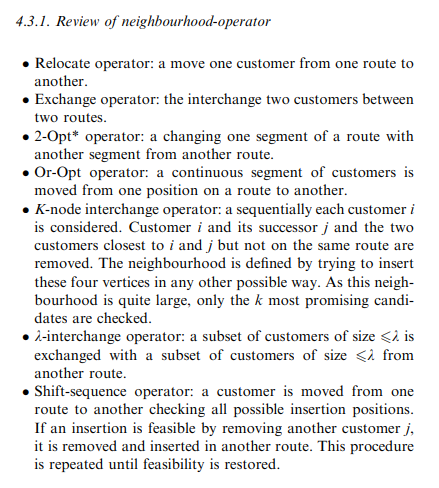
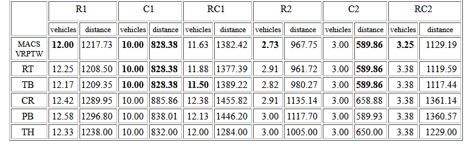

# Vehicle Routing

* Datasets

  [https://data.mendeley.com/datasets/h3mrm5dhxw/1](https://data.mendeley.com/datasets/h3mrm5dhxw/1)

* Neighborhood Operators
  

* Results

  * Ant Colony(MACS-VRPTW has been tested on a classical set of 56 benchmark problems
    (Solomon, 1987) composed of six different problem types (C1,C2,R1,R2,RC1,RC2).
    Each data set contains between eight to twelve 100-node problems. The names
    of the six problem types have the following meaning. Sets C have clustered
    customers whose time windows were generated based on a known solution.
    Problem sets R have customers location generated uniformly randomly over
    a square. Sets RC have a combination of randomly placed and clustered customers.
    Sets of type 1 have narrow time windows and small vehicle capacity. Sets
    of type 2 have large time windows and large vehicle capacity. Therefore,
    the solutions of type 2 problems have very few routes and significantly
    more customers per route.)

    
